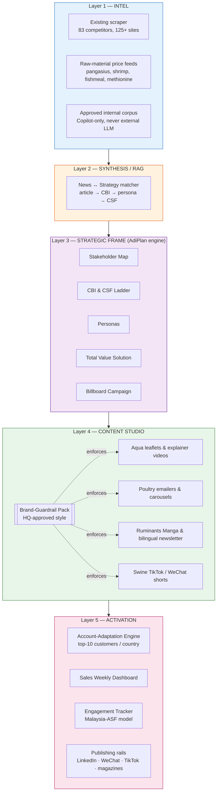
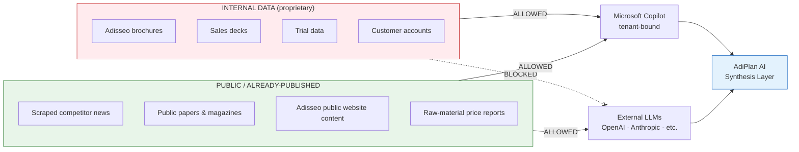
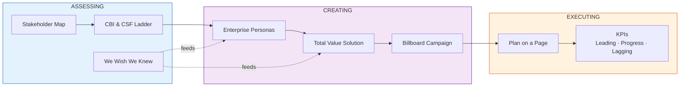
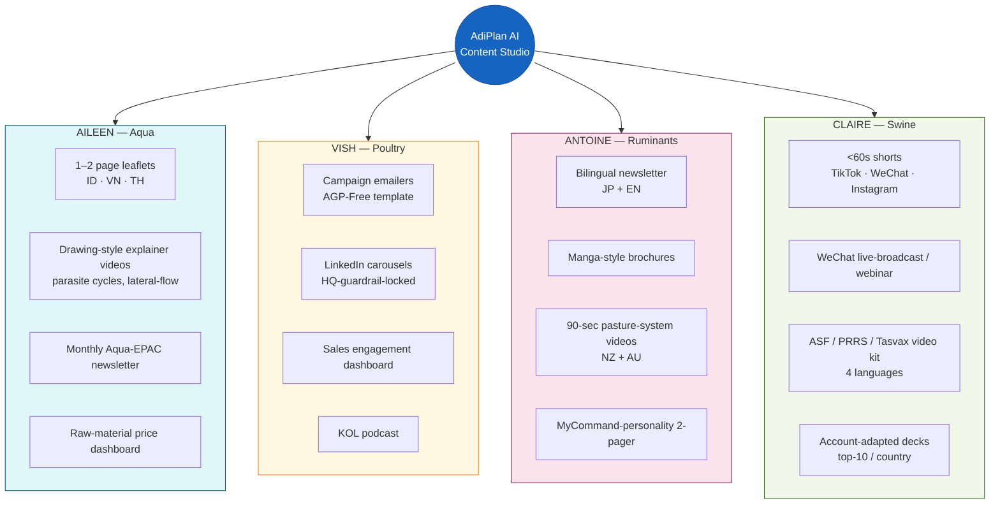
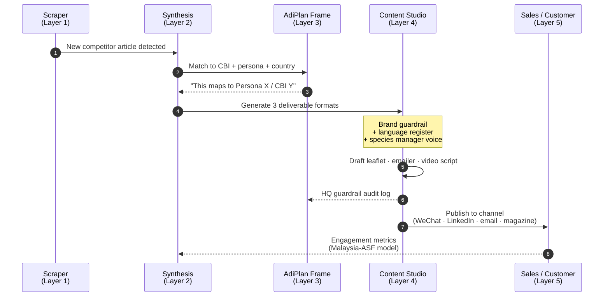
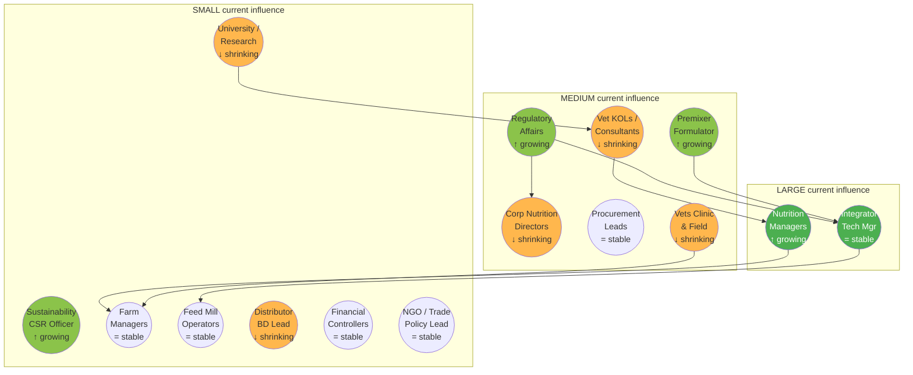
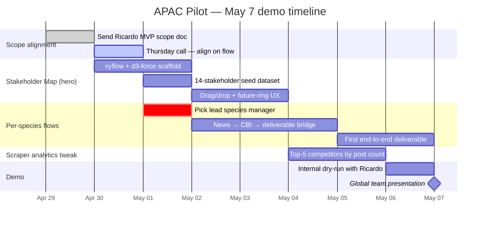

# AdiPlan AI — Visual Plan

> Open this in Cursor with **Cmd+Shift+V** (or any Markdown previewer) to render the diagrams.

---

## 1. The full system at a glance — five layers

---

## 2. AI governance — where the seam runs

---

## 3. AdiPlan framework — the strategic spine

---

## 4. Per-species personalization — one platform, four flavors

---

## 5. The end-to-end flow — scraped article to published deliverable

---

## 6. Stakeholder Influence Map — the May 7 hero demo

> Live version in the platform: nodes are draggable, sized to current influence, ringed with dotted future-influence circles, color-coded by persona cluster. This is the killer Thursday-demo asset.

---

## 7. May 7 pilot — what actually ships

---

## 8. GitHub stack — install priority for May 7

```mermaid
flowchart LR
    subgraph P1["Priority 1 — needed for May 7 demo"]
        R1[xyflow / xyflow]
        R2[d3 / d3-force]
        R3[gka / pptxgenjs]
        R4[vercel / ai]
    end

    subgraph P2["Priority 2 — first species flow"]
        R5[microsoft / markitdown]
        R6[run-llama / llama_index]
        R7[pgvector / pgvector]
        R8[diegomura / react-pdf]
    end

    subgraph P3["Priority 3 — Content Studio breadth"]
        R9[3b1b / manim]
        R10[remotion-dev / remotion]
        R11[comfyanonymous / ComfyUI]
        R12[coqui-ai / TTS]
    end

    subgraph P4["Priority 4 — observability + scale"]
        R13[langfuse / langfuse]
        R14[mendableai / firecrawl]
        R15[tremorlabs / tremor]
    end

    P1 --> P2 --> P3 --> P4

    style P1 fill:#c8e6c9,stroke:#2e7d32
    style P2 fill:#fff9c4,stroke:#f57f17
    style P3 fill:#ffe0b2,stroke:#e65100
    style P4 fill:#e1bee7,stroke:#6a1b9a
```

---

## Cross-references

- Full plan + transcripts of the 4 species-manager calls: [context.md](context.md)
- Source documents: this folder
- Extracted transcript text: `/tmp/adisseo_extract/`
